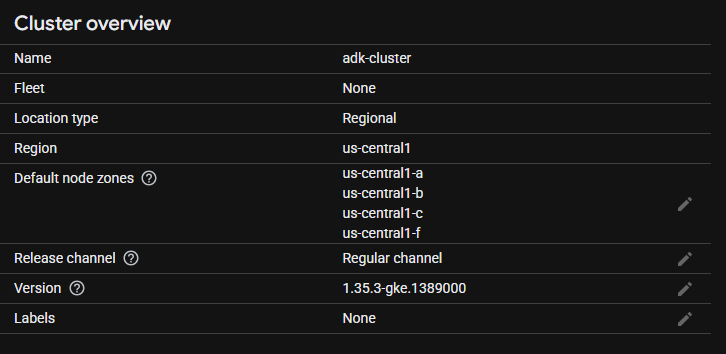
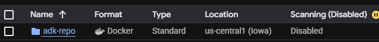
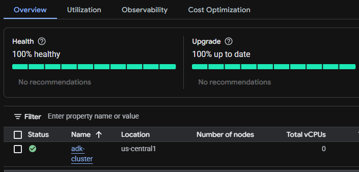
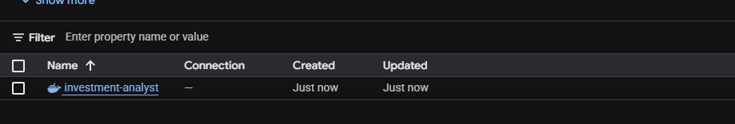
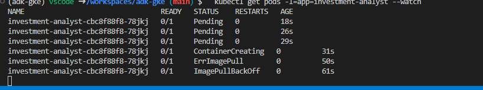
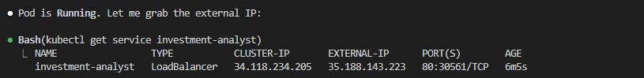
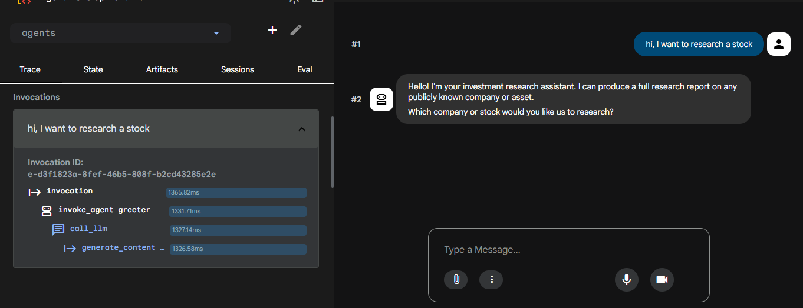
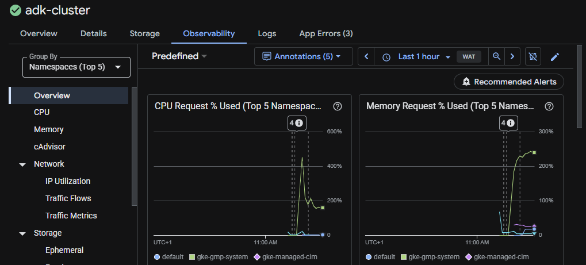

# ADK GKE Screenshot Walkthrough

This page collects the deployment and runtime screenshots for the `adk-gke` project in chronological order.

The filenames use a date-first pattern so the sequence is easy to scan, and each caption preserves the original capture date and time.

## 2026-05-12: Cluster and deployment setup

### Cluster overview

<figure>
  
  <figcaption>Captured 2026-05-12 at 15:23:15. The regional GKE cluster <code>adk-cluster</code> is running in <code>us-central1</code>.</figcaption>
</figure>

### Artifact Registry repository

<figure>
  
  <figcaption>Captured 2026-05-12 at 15:26:36. The container image is stored in the <code>adk-repo</code> Artifact Registry repository.</figcaption>
</figure>

### Cluster health and upgrade status

<figure>
  
  <figcaption>Captured 2026-05-12 at 15:26:51. The cluster overview shows a healthy, up-to-date control plane and no recommendations.</figcaption>
</figure>

### Pod startup and image pull troubleshooting

<figure>
  
  <figcaption>Captured 2026-05-12 at 15:42:27. The investment analyst pod moves through <code>Pending</code>, <code>ContainerCreating</code>, and <code>ImagePullBackOff</code> while the image pull is being debugged.</figcaption>
</figure>

## 2026-05-13: Service exposure and app verification

### Pod rollout and running state

<figure>
  
  <figcaption>Captured 2026-05-13 at 11:11:45. The pod watch confirms the workload transitions into a running state.</figcaption>
</figure>

### LoadBalancer service and external IP

<figure>
  
  <figcaption>Captured 2026-05-13 at 11:16:02. The <code>investment-analyst</code> service has a public <code>LoadBalancer</code> IP and port mapping.</figcaption>
</figure>

### ADK trace for a stock research request

<figure>
  
  <figcaption>Captured 2026-05-13 at 11:22:18. The trace view shows the first chat request, the greeter response, and the invocation chain for the investment research flow.</figcaption>
</figure>

### Cluster observability metrics

<figure>
  
  <figcaption>Captured 2026-05-13 at 11:26:14. The observability dashboard shows CPU and memory request usage for the cluster namespaces.</figcaption>
</figure>
